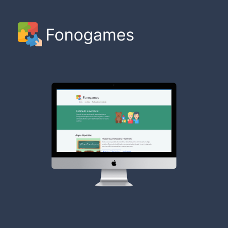

# Hey there!
I'm Luciano Felli, a full-stack app developer with skills in creating apps for Android, iOS, and the Web. You can count on me to bring a fresh approach to your project with my innovative coding style. If you're looking for a developer who is passionate about creating awesome solutions, then you've found the right guy! 
I'm currently on the lookout for new projects to take on, so if you've got an exciting project in mind, let's chat!
  

## Skills

 
  
  
  
  
  
  
  
  
  
  
  
  
  
  

  

## Languages
- Brazilian Portuguese (native)
- English (advanced)

  

## Website
https://lfelli.com
   

 
  	&nbsp;	&nbsp;	&nbsp;
  

   

## Last jobs
### Connect Lingo (mobile app)
  
    Android - https://play.google.com/store/apps/details?id=app.connectlingo.app 
    iOS - https://apps.apple.com/br/app/connect-lingo/id6449234492 
  
 
   

### Fonogames (website)
  
    Web - https://fonogames.com.br
  

   

### Presente, professora! (mobile app)
  
  Android (premium) - https://play.google.com/store/apps/details?id=com.lfelli.presentepremium 
  Android (lite) - https://play.google.com/store/apps/details?id=com.lfelli.presentelite 
  iOS (premium) - https://apps.apple.com/br/app/presente-professora/id1665455464    
  iOS (lite) - https://apps.apple.com/br/app/presente-professora-lite/id1668682918 

 

### Anesthetist Calculator
   

 

### Mem Soccer (mobile app)
  
  Android (premium) - https://play.google.com/store/apps/details?id=com.lxfelli.memsoccer 
  Android (lite) - https://play.google.com/store/apps/details?id=com.lfelli.fonogames 
  iOS (premium) - https://apps.apple.com/br/app/mem-soccer-premium/id1536339482 
  iOS (lite) - https://apps.apple.com/br/app/mem-soccer-lite/id1540502703 